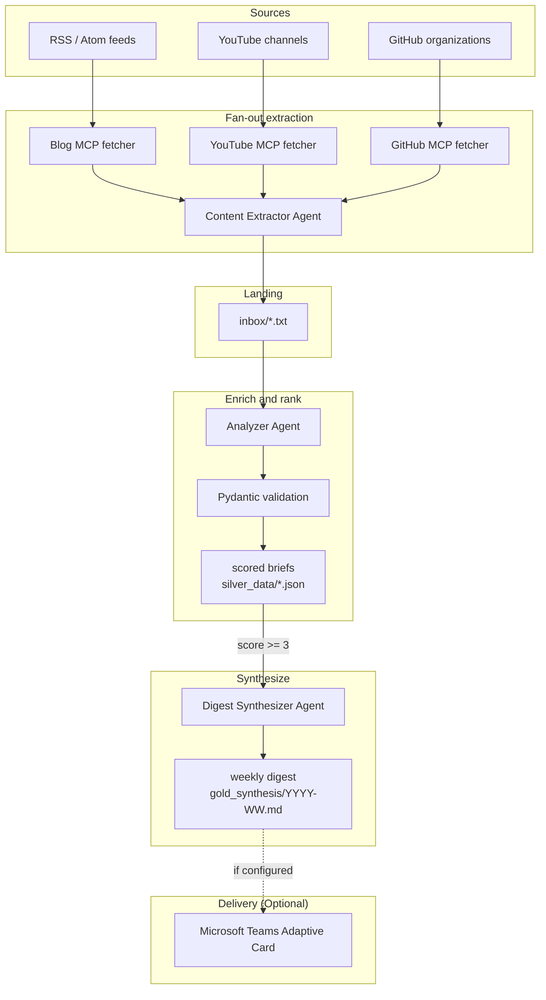

# Architecture

Information Digest is a Semantic ETL pipeline built with Microsoft Agent Framework and Azure AI Foundry.

The system is file-backed by design: every stage leaves an inspectable artifact on disk. That makes the agent's decisions visible, testable, and easy to record.

```text
ingest -> normalize -> enrich -> rank -> synthesize -> publish
```

See `docs/PIPELINE_SPEC.md` for the full stage contract.

## Data Flow



## Components

### Foundry Client

`src/agents/foundry_client.py` centralizes Azure AI Foundry configuration.

Runtime configuration:

- `AZURE_AI_PROJECT_ENDPOINT` is the preferred project endpoint variable.
- `AZURE_AI_PROJECT_CONNECTION_STRING` is accepted as a backward-compatible endpoint URL fallback.
- `AZURE_AI_MODEL_DEPLOYMENT` selects the Foundry model deployment, for example `o4-mini`.
- `DefaultAzureCredential` authenticates the client, so local runs use Azure CLI login and production can move to managed identity.
- `FOUNDRY_RETRY_DELAY_SECONDS` controls one retry delay for low-quota 429 responses.

### Content Extractor Agent

`src/agents/content_extractor_agent.py` wraps MCP fetchers with Microsoft Agent Framework. The fetchers keep source-specific code small and auditable:

- `src/mcp_servers/blog_fetcher.py` fetches RSS/Atom entries.
- `src/mcp_servers/github_fetcher.py` fetches recently updated public repositories and releases.
- `src/mcp_servers/youtube_fetcher.py` is a ready stub for the official YouTube Data API.

### Analyzer Agent

`src/agents/silver_analyzer_agent.py` reads raw files from `inbox/`, asks the Foundry-backed model to produce a structured brief, and validates the response with `SilverBrief`.

Each item gets:

- What happened.
- Why it matters now.
- How it works or how to use it.
- So what for the user's profile.
- A relevance score from 1 to 5.

Only validated JSON is written to `silver_data/`.

### Digest Synthesizer Agent

`src/agents/master_synthesizer_agent.py` loads validated scored briefs, filters out score 1-2 noise, and synthesizes the remaining items into a weekly Markdown digest.

The synthesis stage is deliberately opinionated: it should help the user decide what to read, what to ignore, and what to act on.

### Operator Mapping

The pipeline can be read in DocETL-style operator terms:

- `map`: analyze each inbox item independently.
- `extract`: produce the fields in `SilverBrief`.
- `validate`: enforce the Pydantic schema.
- `filter`: drop score 1-2 items.
- `reduce`: synthesize selected briefs into one weekly digest.
- `publish`: write to Markdown (primary) and optionally send to Teams.

### Teams Delivery

`src/integrations/teams_notifier.py` converts the digest into a Teams Adaptive Card payload. If `TEAMS_WEBHOOK_URL` is missing, notification is skipped gracefully. This allows for a zero-dependency local-first demo.

## Reasoning Pattern

The visible reasoning chain is:

1. Plan the run and apply local cost guards.
2. Fetch a bounded set of sources.
3. Analyze each raw item against the user's profile.
4. Validate structured output.
5. Rank and filter score >= 3 items.
6. Synthesize a concise weekly decision brief.
7. Publish the result to Markdown (primary) and Teams (optional).

This chain is surfaced in terminal logs so the demo can show multi-step reasoning rather than only the final answer.

## Reliability And Safety

The project uses several pragmatic safety controls:

- Local cost caps: `MAX_SOURCES_PER_RUN`, `MAX_INBOX_ITEMS_PER_RUN`, and `MAX_CONTENT_CHARS_PER_ITEM`.
- Pydantic validation for every scored brief output.
- Schema invalid outputs are saved as `_INVALID_*.json` for inspection.
- Unit tests run without Azure credentials.
- Optional golden dataset evals can be run before demo submission.
- Teams notification failures do not fail the pipeline.
- A tiny real Foundry smoke test succeeded end-to-end; see `docs/CLOUD_SMOKE_TEST.md`.

Production hardening would add private networking, APIM, persistent storage, managed identity in Azure hosting, and CI quality gates.
